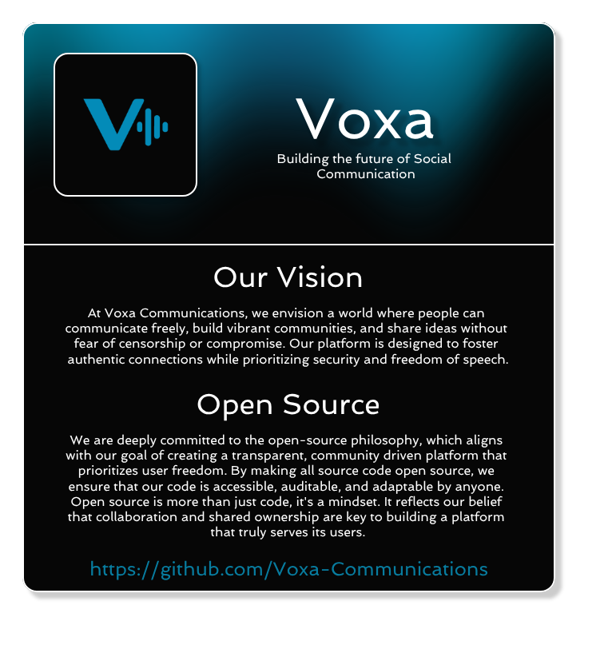

---

# Voxa Communications

**Building the Future of Social Communication**

Voxa Communications is an innovative tech company dedicated to creating a next-generation social media platform that blends the seamless community engagement of Discord with the dynamic, real-time interaction of Twitter. Our mission is to empower users to connect, share, and express themselves in a secure and open digital environment.

## Our Vision
At Voxa Communications, we envision a world where people can communicate freely, build vibrant communities, and share ideas without fear of censorship or compromise. Our platform is designed to foster authentic connections while prioritizing **security** and **freedom of speech**.

### Key Features
- **Community Hubs**: Create and join servers for topics you love, with voice, video, and text channels for real-time interaction, inspired by Discord’s intuitive design.
- **Real-Time Feeds**: Share short posts, media, and updates in a Twitter-like stream, amplified by hashtags, retweets, and threaded conversations.
- **Customizable Profiles**: Express yourself with rich profiles, avatars, and banners. All for free!
- **End-to-End Encryption**: Protect your conversations with industry-leading security protocols to ensure privacy.
- **Community Governance Tools**:  Moderate and protect your community with tools to set guidelines, manage interactions, and promote engagement.
- **Open API**: Enable developers to build bots, integrations, and custom experiences.

## Our Products
We offer the full-stack of programs, both server and client, designed to give both developers and users a seemless user experience \
** Developer Note: ** These are presented projects, however at the moment they remain concepts, while this orginization materializes
 - **[Voxa Client](https://github.com/Voxa-Communications/VoxaCommunications-Client)** A cross-platform application available on desktop (Windows, Linux, macOS [LIMITED SUPPORT] ), mobile (iOS [LIMITED SUPPORT] , Android), and web browsers. The client provides an intuitive interface for joining communities, participating in real-time feeds, and engaging in voice, video, and text conversations. It’s built for performance and accessibility, ensuring a smooth experience across devices.
 - **[Voxa Server](https://github.com/Voxa-Communications/VoxaCommunications-Server)** A robust, open-source server software that powers our platform’s backend. Communities can host their own servers to create private or public hubs, giving them full control over their data and governance. The server is optimized for scalability and security, supporting thousands of concurrent users.
 - **Voxa CDN/DB** A scaleable contanerized Content Delivery Network, that provides users with the seemless image and file sharing experience
 - **[Voxa Proxy](https://github.com/Voxa-Communications/VoxaCommunications-Proxy)** A powerful, open-source proxy service designed to protect the privacy and security of decentralized Voxa servers by anonymizing their identities and concealing their IP addresses. Voxa Proxy serves as a secure intermediary between clients and servers, ensuring that server operators can host communities without exposing their infrastructure to potential threats or identification.
 - **[Voxa Registry](https://github.com/Voxa-Communications/VoxaCommunications-Registry)** Registry of all decentralized Voxa servers, as well as users. Developer Note: This is one of the programs that you probably wont need to host. Idealy we have only one offical Voxa registry that everyone uses.
 - **Voxa Docs [API / Developer Portal]** Provides developers with detalied guides on how to develop applications for Voxa, and how to deploy those applications.

## Commitment to Security
We believe that trust is the foundation of any social platform. Voxa Communications employs advanced security measures, including:
- **End-to-end encryption** for private messages and voice calls.
- **Two-factor authentication** to safeguard user accounts.
- **Regular security audits** to identify and address vulnerabilities.
- **Data minimization** practices to collect only what’s necessary.

Your privacy and safety are non-negotiable, and we’re committed to maintaining a platform where you can communicate with confidence.

## Freedom of Speech
Voxa Communications is built on the principle that open discourse is essential for progress. We strive to create a platform where voices can be heard, and ideas can be shared freely, while balancing the need for responsible moderation to prevent harm. Our policies are transparent, and our moderation processes are designed to be fair and accountable.

## Our Funding Model
We operate as a not-for-profit organization, driven by our mission to create a free and open communication platform rather than financial gain. We are funded through:
 - Sponsorships: Partnerships with like-minded organizations that share our vision for secure and open communication.
 - Crowdfunding: Contributions from our passionate community of supporters who believe in our mission.

This model ensures that our priorities remain aligned with our users’ needs, allowing us to focus on delivering a platform that serves the public good without the pressures of profit-driven motives.

## Join Us
Be part of the Voxa Communications revolution! Whether you’re a gamer, creator, or just someone who loves to connect, our platform is for you. Sign up for our beta at [Voxa-Communications](https://voxa-communications.github.io) and help shape the future of social media.

## Legal
Copies of all legal documents are located in `Voxa-Communications/legal`
 - **[Voxa Terms of Service](https://github.com/Voxa-Communications/legal/raw/refs/heads/main/documents/TOS.txt)**
 - **[Voxa Privacy Policy](https://github.com/Voxa-Communications/legal/raw/refs/heads/main/documents/PrivacyPolicy.txt)**
 - **[Open Source Licenses]()**

**Follow us**: [Twitter/X](https://x.com/VoxaOffical) | [Pateron](https://patreon.com/VoxaCommunications) | [Telegram](https://t.me/voxacommunications) | [Discord](https://discord.gg/EDtPX5E4D4) | [Dev.to(Account, not org)](https://dev.to/voxacommunications-account)
**Contact**: voxa@connor33341.dev
